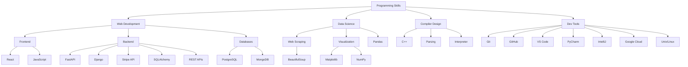

# 👋 Hi, I'm Ibrahim Haroon

I'm a Computer Science student at NJIT, passionate about building impactful software and exploring the intersection of AI, web development, and data science. I love collaborating on open-source projects and learning new technologies.

## 🚀 Projects

### 🛒 E-Commerce Website
**Stack:** FastAPI, PostgreSQL, Stripe, JavaScript, React  
Built a full-stack e-commerce platform with secure payment processing, RESTful APIs, and a React frontend.

### 🤖 Hackathon AI Bot
**Stack:** Python, HTML, CSS, GitHub, PhilaData, Django  
Led a team to develop an AI chatbot during a hackathon, integrating backend logic and a functional terminal-based prototype.

### 🌐 Web Scraping Data Visualizer
**Stack:** Python, BeautifulSoup, Matplotlib, NumPy  
Created a tool to extract and visualize data from HTML web pages, with robust testing and data transformation.

### �️ Fortran-95 Compiler
**Stack:** C++  
Designed a lexical analyzer and interpreter for Fortran-95, supporting dynamic execution and error handling.

## �️ Skills

**Programming Languages:** Python, C, C++, Bash, Java, SQL  
**Frameworks:** Django, FastAPI, React  
**Libraries:** BeautifulSoup, Matplotlib, NumPy, Pandas, PyMongo, Stripe, SQLAlchemy  
**Databases:** PostgreSQL, MongoDB  
**Tools:** Git, GitHub, VS Code, PyCharm, IntelliJ, Google Cloud Platform, Unix/Linux

## 🌳 Skill Tree

## 📫 Contact

- Email: ih628@njit.edu
- [LinkedIn](https://linkedin.com/in/ibrahim-haroon)
- [GitHub](https://github.com/IbrahHaroon)

---
✨ Always open to collaboration and new opportunities! ✨
